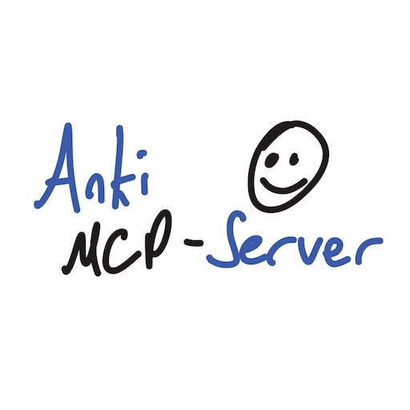
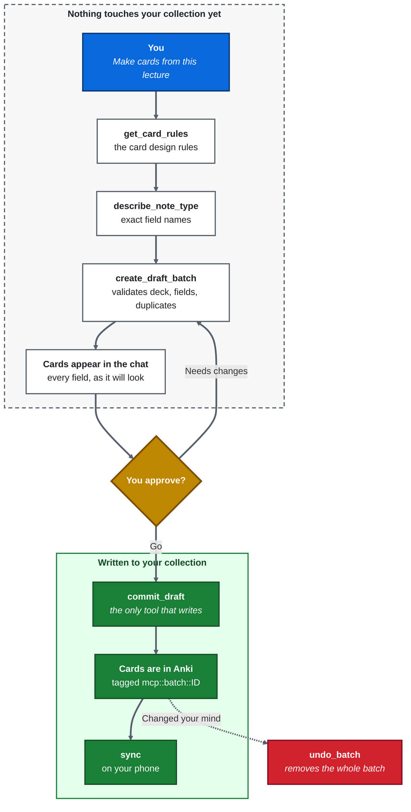

<p align="center">
  
</p>

<h1 align="center">Anki MCP</h1>

<p align="center">
  <b>Turn lecture material, YouTube videos or any other context from your chat into Anki cards worth keeping.</b>
</p>

<p align="center">
  <a href="LICENSE"></a>
  
  
  
</p>

An MCP server that lets Claude read your lecture material, transcribe YouTube Videos and write Anki flashcards from it.
It talks to your running Anki through [AnkiConnect](https://ankiweb.net/shared/info/2055492159).

Most LLM-to-Anki tools do one thing: take text, produce cards, write them. That produces a lot
of cards and not much learning. Anki MCP connects Claude directly to Anki and has it generate
cards that are actually worth reviewing, grounded in your own material.

## Demo

**Asking Claude for cards from a YouTube video combined with lecture slides**

https://github.com/user-attachments/assets/68d1f24f-7f6c-480d-aa16-c312484f873b

**Output, clicked through in Anki**

https://github.com/user-attachments/assets/00ac5217-9e81-4b8c-8479-c9aa38729dc4


## Requirements

- **Anki 23.10 or newer**, running while you use the server
- The [AnkiConnect](https://ankiweb.net/shared/info/2055492159) add-on, code `2055492159`
  - Install it in Anki under ***Tools → Add-ons → Get Add-ons***, then restart Anki

## Install

### 1. Claude Desktop (recommended)

1. Download `anki-mcp-server-1.0.0.mcpb` from the [latest release](../../releases/latest).
2. Double-click it. Claude Desktop installs it as an extension automatically.

### 2. Any MCP client, from source

```bash
git clone https://github.com/MichaelPrutkow/anki-mcp-server.git
cd anki-mcp-server
uv sync
```

Then point your client at it:

```json
{
  "mcpServers": {
    "anki": {
      "command": "uv",
      "args": ["run", "--directory", "/absolute/path/to/anki-mcp-server", "-m", "anki_mcp"]
    }
  }
}
```

## Personal design decisions and differentiators

### Nothing is written until you say so

Cards go into a **draft** first. A draft lives in the server's memory, is validated against your
note type, checked for duplicates, and shown to you in the chat. Only `commit_draft` writes to
your collection, and the card rules forbid calling it in the same turn as the draft.

> [!NOTE]
> Drafts and YouTube transcripts are cached in memory and retrieved by ID instead of being
> passed around in prompts. This drastically reduces token usage.

> [!WARNING]
> Both are lost when the server is killed. Commit your drafts in one sitting and do not close
> Claude Desktop in the process.


<details>
  <summary><h3> Click to view: Example of the generated Anki Math cards</h3></summary>
  <br>
  
</details>


### Every batch can be removed again

Each commit tags its notes `mcp::batch::<id>`. One call to `undo_batch` with that id removes the
whole batch. Cards this server did not create carry no `mcp::created` tag, so they cannot be
deleted or edited by accident. Touching one requires an explicit `force=True` after asking you.

### Specific card rules

The server ships a long and exhaustive prompt, designed with `Claude Opus 5`, covering
card-design rules that the client loads on demand via `get_card_rules`. They are opinionated
and specific:

- One fact per card. If the answer contains an "and", it is usually two cards.
- No yes/no questions. A coin flip is right half the time and retrieves nothing.
- Never a set or a list: those become separate cloze deletions.
- For a theorem: separate cards for the statement, the hypotheses, what breaks without them,
  and the key idea of the proof.
- Rules on phrasing, so the wording stays human instead of clanker-like, inspired by
  [Wikipedia: Signs of AI writing](https://en.wikipedia.org/wiki/Wikipedia:Signs_of_AI_writing).

<details>
  <summary><h3>Click to view: Example of the generated Anki cards</h3></summary>
  <br>
  
</details>


### One bad card does not kill the batch

Notes are written individually in a single request. If one collides with an existing card, the
other 49 still land, and the failed one stays in the draft with the reason attached.

### YouTube lectures without burning your context

`extract_youtube_video_transcript` returns a timestamped outline for long videos instead of the
full transcript. Claude picks the intervals that matter and asks for those, which makes long
videos far cheaper than pulling the whole transcript into the chat.

<!-- TODO: Gif YouTube -->
<p align="center">
  
</p>

## Tools

| Tool | Access | What it does |
| --- | --- | --- |
| `get_card_rules` | read | Returns the card-design rules. Claude calls this before writing cards. |
| `list_decks` | read | All deck names |
| `describe_note_type` | read | Field names of a note type, or all note types |
| `search_notes` | read | Search with Anki's query syntax, optionally with field contents |
| `create_draft_batch` | read | Start a draft and optionally fill it. Writes nothing. |
| `add_to_draft` | read | Append notes to a draft. Validates fields and duplicates. |
| `extract_youtube_video_transcript` | read | Transcript or navigable outline of a YouTube video |
| `sync` | read | Push to AnkiWeb so the cards reach your phone |
| `create_deck` | **write** | Create a deck, `::` creates subdecks |
| `commit_draft` | **write** | The only tool that writes cards to your collection |
| `undo_batch` | **write** | Remove an entire batch by its id |
| `delete_notes` | **write** | Delete individual notes, only ones this server created |
| `update_note_fields` | **write** | Fix a card without losing its review history |

Read-only tools are annotated as such, so a client that asks for permission only asks for the
five that change anything.

> [!TIP]
> Run `sync` after committing and the new cards are on your phone before you close the laptop.

## How it works



## Safety

> [!IMPORTANT]
> This server writes to your real collection. Make a backup before the first run:
> ***File → Export → Anki Collection Package***.

What the server will not do however:

- Write anything without an explicit `commit_draft`
- Delete a note it did not create
- Edit a note it did not create, unless you approve `force=True`

## Known limits

- **No dialog window may be open in Anki.** A modal blocks AnkiConnect entirely, and every call
  runs into a 30 second timeout until you close it.
- **Drafts are in-memory.** They expire after 30 minutes and are lost when the server restarts.
- **Duplicate detection follows Anki's rule**: only the first field of a note type is compared.
  Two cards with the same question and different answers count as duplicates.
- **No image support yet.** Extracting figures from PDFs and building image-occlusion cards is
  planned, not built (but I'm planning on adding this in the future)

## Development

```bash
uv sync
uv run ruff check src/ && uv run ruff format src/
uv run python -c "import anki_mcp.server"     # catches import errors
```

Run the server against a client manually:

```bash
uv run -m anki_mcp
```

Build the `.mcpb` bundle (requires Node for `npx`):

```bash
./tools/build.sh
```

The script refuses to build if `pyproject.toml` and `manifest.json` disagree on the version, or
if the bundled sources drift from `src/`.

## Personal AI Use
I wrote almost all of this code myself because I wanted to use this project to learn. I did use some AI assistance, but strictly for formulating my ideas for the long system prompt and this README, as well as for minor bug fixes and some helper and utility functions.


## Credits

- [AnkiConnect](https://git.sr.ht/~foosoft/anki-connect) by foosoft, the add-on this talks to
- [youtube-transcript-api](https://github.com/jdepoix/youtube-transcript-api) by jdepoix

